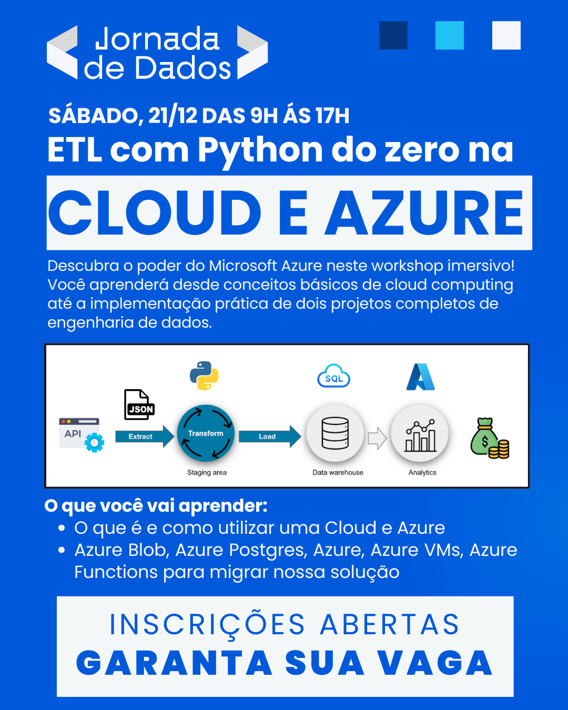
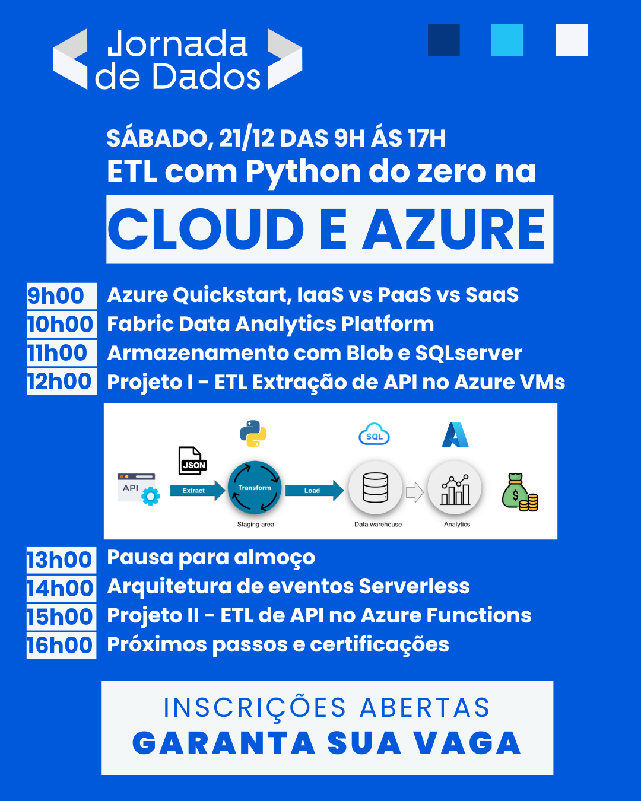

 

  

    <em>Nossa missão é fornecer o melhor ensino em engenharia de dados</em>

Bem-vindo a **Jornada de Dados**

# Workshop Microsoft Azure

---

Esquema do projeto: [app.excalidraw.com](https://link.excalidraw.com/l/8pvW6zbNUnD/2gahrXjzy54)

---

### Site

Para se inscrever: [workshop-azure](https://suajornadadedados.com.br/workshop-azure/)

### Fabric

[repositório](https://github.com/alanceloth/fabric-hello-world)

### Resumo
Este workshop tem como objetivo fornecer uma introdução prática ao uso da Microsoft Azure, abordando desde a criação de contas e controle de custos até a implementação de serviços como Azure VMs, Azure Serverless e Azure Active Directory. Os participantes irão aprender a navegar na interface do Azure, criar e gerenciar recursos, além de desenvolver projetos práticos que envolvem ETL e aplicativos web escaláveis.

- Como fazer o deploy da minha aplicação
- Mostrar como desenvolver uma ETL Extração API com AzureVMs
- O Azure é mais do que isso
- Serviços que possibilitam criar aplicações modernas

### O que é Cloud
Revisaremos os conceitos fundamentais de Cloud Computing, destacando as vantagens da escalabilidade, custo-eficiência, acessibilidade e segurança oferecidas pela nuvem. Discutiremos também o que não constitui uma solução de cloud, como a diferença entre cloud e data centers on-premise, além de mitigar a percepção de que a nuvem é sempre a opção mais barata.

### Tópico ou Unidade de Estudo
1. Introdução ao Azure e Cloud Computing
2. Criação e Configuração de Conta no Azure
3. Controle de Custos no Azure
4. Navegação na Interface Gráfica do Azure
5. Visão Geral dos Produtos Azure
6. Tipos de Serviço no Azure
7. Tipos de Serviço no Azure
8. Criação e Configuração de Serviços de Armazenamento (Blob Storage) e Azure SQLServer
9. Criação e Configuração de Máquinas Virtuais (Azure VMs)
10. Desenvolvimento de Projetos Práticos (ETL e Serverless)

### Objetivo
Fornecer uma introdução prática ao uso da Microsoft Azure, capacitando os participantes a criar e gerenciar recursos na nuvem, implementar soluções escaláveis e seguras, e desenvolver projetos que utilizem serviços de dados e computação disponíveis na plataforma Azure.

### Alocação de Tempo

### Contexto de Aprendizado
Introdução ao Azure e Cloud Computing, com foco em aplicações na área de dados. Revisão de conceitos anteriores para assegurar que os alunos estão preparados para absorver conteúdos novos e avançados.