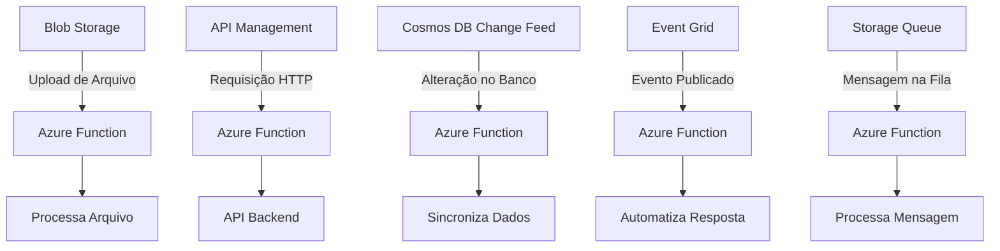

### Azure Functions e Eventos na Nuvem

**Objetivo**: Nesta aula, exploraremos o **Azure Functions** e seu papel dentro de arquiteturas serverless no Azure. Vamos entender as diferenças entre o Azure Functions e o Azure Virtual Machines (VMs), discutir suas vantagens e desafios, e aprender como eventos podem ser aproveitados para criar sistemas escaláveis e eficientes.

---

### **1. Introdução ao Azure Functions**

O **Azure Functions** é um serviço serverless que permite executar código sob demanda em resposta a eventos. É ideal para cenários que requerem escalabilidade automática e custos baseados no uso, como uploads no Azure Blob Storage, alterações em bancos de dados, e requisições HTTP por meio do Azure API Management.

**Conceito de Serverless no Azure**: O termo “serverless” refere-se à abstração completa da infraestrutura pelo Azure, permitindo que você se concentre apenas no código, enquanto a Microsoft gerencia a execução nos bastidores.

---

### **2. Diferença entre Azure Functions e Azure VMs**

#### **2.1. Azure Virtual Machines**
- **Definição**: Serviço que permite criar e gerenciar máquinas virtuais, com controle total sobre o sistema operacional e aplicativos instalados.
- **Vantagens**:
  - **Controle Completo**: Configuração detalhada do ambiente de software e hardware.
  - **Persistência**: Ideal para aplicações que exigem disponibilidade contínua.
  - **Flexibilidade**: Escolha do sistema operacional e personalização completa.
- **Desafios**:
  - **Gerenciamento**: Requer manutenção, atualizações e monitoramento constantes.
  - **Custo**: Pagamento contínuo enquanto a VM está ativa.
  - **Configuração Complexa**: Requer atenção a segurança, rede e armazenamento.

#### **2.2. Azure Functions**
- **Definição**: Serviço que executa código em resposta a eventos, sem a necessidade de gerenciar servidores.
- **Vantagens**:
  - **Serverless**: Reduz drasticamente a complexidade operacional.
  - **Escalabilidade Automática**: Ajusta automaticamente com base nos eventos recebidos.
  - **Custo-Eficiência**: Ideal para cargas intermitentes, com pagamento apenas pelo uso.
- **Desafios**:
  - **Cold Starts**: Pequeno atraso ao ativar funções após períodos de inatividade.
  - **Limitações de Execução**: Restrições de tempo e recursos computacionais.
  - **Configuração de Binding**: Requer atenção para assegurar integração e segurança.

---

### **3. Arquitetura Serverless com Azure Functions**

#### Diagrama de Arquitetura



---

### **4. Configurando uma Função Azure Functions**

#### 4.1. Criar Função no Azure Portal:
1. Acesse o portal do Azure ([Azure Portal](https://portal.azure.com)).
2. Vá para **Azure Functions** e clique em **Create**.
3. Preencha os campos principais:
   - **Function App Name**: `TesteMinhaPrimeiraFunction`.
   - **Runtime Stack**: Escolha `Python` ou outra linguagem preferida.
   - **Region**: Escolha uma região próxima.

#### 4.2. Criar uma Função HTTP Trigger:
1. No portal do Azure, dentro do Function App criado, selecione **Functions**.
2. Clique em **Create** e escolha o **HTTP Trigger**.
3. Nomeie a função como `HttpTriggerExample`.

#### 4.3. Adicionar Código ao VS Code:
1. Instale as extensões necessárias no VS Code:
   - **Azure Functions**.
   - **Azure CLI**.
2. No terminal, inicialize um projeto:
   ```bash
   func init MeuProjeto --worker-runtime python
   cd MeuProjeto
   func new --template "HTTP trigger" --name HttpTriggerExample
   ```
3. Edite o arquivo `HttpTriggerExample/__init__.py` com o seguinte código:

   ```python
   import logging
   import azure.functions as func

   def main(req: func.HttpRequest) -> func.HttpResponse:
       logging.info('Função HTTP Trigger acionada.')
       nome = req.params.get('nome')
       if not nome:
           try:
               req_body = req.get_json()
           except ValueError:
               pass
           else:
               nome = req_body.get('nome')

       if nome:
           return func.HttpResponse(f"Olá, {nome}!")
       else:
           return func.HttpResponse(
               "Por favor, envie um nome na requisição.",
               status_code=400
           )
   ```

#### 4.4. Testar Localmente:
1. No terminal, inicie o servidor local:
   ```bash
   func start
   ```
2. Acesse `http://localhost:7071/api/HttpTriggerExample` em um navegador ou ferramenta como Postman.
3. Envie uma requisição GET ou POST com o parâmetro `nome`.

---

### **5. Casos de Uso do Azure Functions**
- **Processamento de Arquivos**: Automatizar tarefas como redimensionamento de imagens e extração de dados.
- **APIs Serverless**: Criar backends de APIs que respondem a eventos HTTP.
- **Eventos de IoT**: Responder a dados de dispositivos IoT em tempo real.
- **ETL e Pipelines**: Realizar transformações de dados baseadas em eventos.
- **Automação**: Tarefas automatizadas como limpeza de logs e envio de notificações.

---

### **6. Comparação de Cenários de Uso: Azure Functions vs. Azure VMs**

| **Critério**           | **Azure VMs**                              | **Azure Functions**                       |
|------------------------|--------------------------------------------|------------------------------------------|
| **Controle**           | Total sobre o ambiente                    | Limitado ao código                       |
| **Persistência**       | Executa continuamente                     | Executa sob demanda                      |
| **Escalabilidade**     | Manual ou configurada                     | Automática                               |
| **Gerenciamento**      | Requer manutenção                         | Automação pelo Azure                     |
| **Custo**              | Contínuo enquanto ativo                   | Paga apenas pelo uso                     |
| **Tempo de Resposta**  | Menor em execução contínua                | Pode haver cold starts                   |

---

### **Conclusão**
O **Azure Functions** simplifica a execução de código serverless, fornecendo escalabilidade e economia de custos. Comparado ao Azure VMs, ele reduz a complexidade de gerenciamento, mas exige um entendimento claro de suas limitações. A escolha entre Azure Functions e Azure VMs deve considerar o caso de uso, pesando controle, custo e escalabilidade.